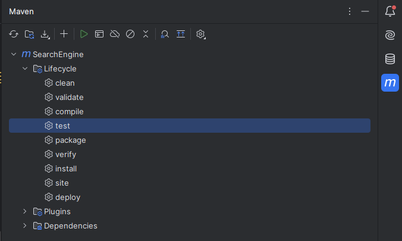
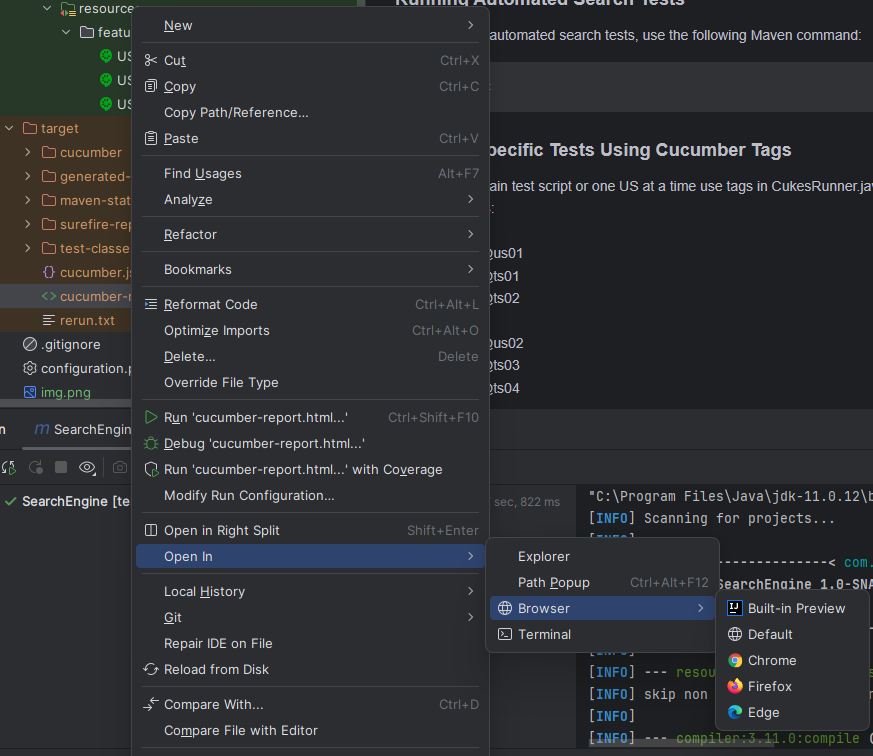

# Search Automation Project

Automate Google and Yahoo search pages using Selenium WebDriver, Java, and Cucumber.

## Table of Contents

- [Project Overview](#project-overview)
- [Features](#features)
- [Getting Started](#getting-started)
- [Usage](#usage)
  - [Running Automated Search Tests](#running-Automated-Search-Tests)
  - [Running Specific Tests Using Cucumber Tags](#running-Specific-Tests-Using-Cucumber-Tags)
  - [List of Tags](#list-of-tags)
  - [Running All Test Cases in Parallel](#running-all-test-cases-in-parallel)
  - [Generating and Retrieving Test Reports](#generating-and-retrieving-test-reports)
- [Troubleshooting](#troubleshooting)
  - [Common Error Messages](#common-error-messages)
    - [No Visible Action during Test Execution](#no-visible-action-during-test-execution)
  - [Known Issues](#known-issues)
    - [Failed Test Scenarios](#failed-test-scenarios)
- [Dependencies and Plugins](#dependencies-and-plugins)
  - [Dependencies](#dependencies)
  - [Plugins](#plugins)
- [Configuration](#configuration)
- [Enhancing Capabilities](#enhancing-capabilities)
  - [Configuring Environments](#configuring-environments)
  - [Implementing Selenium Grid](#implementing-selenium-grid)
  - [Automating Continuous Integration with Jenkins](#automating-continuous-integration-with-jenkins)
  - [Utilizing Java Faker for Data Generation](#utilizing-java-faker-for-data-generation)

## Project Overview

This project utilizes Selenium WebDriver in Java to automate searches on Google and Yahoo search pages. It is designed to demonstrate how to perform automated browser interactions using a BDD (Behavior-Driven Development) approach with Cucumber.

## Features

- Automated Google search
- Automated Yahoo search
- BDD test scenarios with Cucumber
- Easy-to-understand project structure

## Getting Started

Follow these steps to set up the project locally:

1. **Open a Command Prompt or Git Bash:**

   You can use the default Command Prompt on Windows or Git Bash if you have it installed. You can find Git Bash in the Start menu after installing Git.
      
2. **Navigate to the Directory Where You Want to Clone the Project:**

   Use the cd command to navigate to the directory where you want to clone the Git project. For example:
   ```bash
   cd path\to\desired\directory
3. **Clone the Repository:**

   Use the git clone command to clone the repository.
   ```bash
    git clone https://github.com/sabinasattarova/SearchEngineDemo.git
    cd search-automation
4. **Navigate to the Cloned Project Directory:**
   ```bash
   cd project-directory
   
## Usage
### Running Automated Search Tests
1. **To run the automated search tests, use the following Maven command:**
   ```bash
   mvn test
   ```
2. **Alternatively, you can run tests through the CukesRunner.java class.**  

   
### Running Specific Tests Using Cucumber Tags
3. **To run certain test script or one US at a time use tags in CukesRunner.java in the tags = " " option**

### List of Tags
| User Story | User Story Tag | Test Scenarios  |
|------------| --------------- | ---------------- |
| US01       | @us01          | @ts01, @ts02     |
| US02       | @us02          | @ts03, @ts04     |
| US03       | @us03          | @ts05, @ts06     |
 
        
 Example command to run tests for US01:

        mvn test -Dcucumber.filter.tags="@us01"

### Running All Test Cases in Parallel
4. **To run all test cases in parallel, follow these steps:**


- Click on the Maven logo (M) on the right corner of your IDE.
- Unfold the "SearchEngine" tab.
- Double-click on the "test" goal.


### Generating and Retrieving Test Reports
Test reports can be generated after running the tests. To access the reports:

- After running tests, navigate to the `target` directory.
- Locate the cucumber-reports folder.
- Locate the cucumber-report named `(cucumber-report.html)` and open in a web browser to view the results.
- The report provides detailed information about test execution, including scenarios passed, failed, screenshots of 
  failed tests, total number of passed and failed, OS, JDK version, duration of execution time, last ran time.




## Troubleshooting

If you encounter issues while running the tests, consider the following troubleshooting tips:

### Common Error Messages
#### No Visible Action during Test Execution

If your tests are running, but you don't see any action happening, check the following features:

- **Dry Run Setting:**
    - If `dryRun` is set to `true` in your Cucumber configuration, no actual browser interaction occurs. Make sure it is set to `false` for real test execution.

- **Headless Chrome Setting:**
    - If you have specified `headless-chrome` in the `configuration.properties` file, try changing it to `"chrome"`, `"firefox"` for a visible browser window.

Example:
```properties
    # configuration.properties
    browser=chrome
    # or
    browser=firefox
```

### Known Issues

#### Failed Test Scenarios

If you encounter failed test scenarios, it might be due to variations in google or yahoo algorithms, ranking criteria, web crawling methods, data sources.

#### Recommendation: Constantly Changing Data Input

To address this issue, it's recommended to utilize Java Faker libraries to generate new and dynamic data for each search. 

This helps in adapting the test scenarios to variations in data, ensuring a more robust and adaptable testing approach.

By constantly changing the data input, the resilience of test scenarios can be enhanced to variations in underlying factors.

Example implementation:

```java
// Sample code using Java Faker for data generation
import com.github.javafaker.Faker;

public class TestDataGenerator {
    public static void main(String[] args) {
        Faker faker = new Faker();

        // Example usage for generating a dynamic search query
        String searchQuery = faker.lorem().word();
        System.out.println("Generated Search Query: " + searchQuery);
    }
}
```


## Dependencies and Plugins

### Dependencies

| Library            | Author          | Version |
| ------------------ | --------------- | ------- |
| WebDriverManager   | Bonigarcia       | 5.5.3   |
| Selenium-Java      | Selenium        | 4.17.0  |
| Cucumber-JUnit     | Cucumber        | 7.3.2   |
| Cucumber-Java      | Cucumber        | 7.3.2   |

### Plugins

| Plugin                | Author                  | Version       |
| --------------------  | ----------------------- | ------------- |
| Reporting Plugin      | Cucumber                | 7.3.0         |
| Maven Surefire Plugin  | Apache Maven Plugins    | 3.0.0-M5      |


## Configuration

**The primary configuration is managed through the `configuration.properties` file.** This file contains key-value pairs 
that 
control various aspects of the project. Users can locate and modify this file to adjust settings.


| Setting       | Value                      | Comment                                                                   |
|---------------| -------------------------- |---------------------------------------------------------------------------|
| browser       | chrome                     | Specifies the browser for Selenium WebDriver.                             |
| environment   | qa1                        | Defines the environment to be tested.                                     |
| google        | [https://www.google.com/](https://www.google.com/)  | URL for the Google search page.                                           |
| yahoo         | [https://www.yahoo.com/](https://www.yahoo.com/)    | URL for the Yahoo search page.                                            |
| searchEngine | google                     | Configures the default search engine for US01 and US02 (google or yahoo). |


## Enhancing Capabilities
### Configuring Environments
### Implementing Selenium Grid
Selenium Grid is a powerful tool for distributed test execution.

Implementing Selenium Grid allows to run tests concurrently across multiple machines, enabling parallel testing and cross browser testing optimizing resource utilization.

#### Steps to implement
1. Update Singleton Design Driver class in Utilities package with adding inside of switch statement following code:
    ```properties
         case "remote-chrome":
                    try {
                        // assign your grid server address
                        String gridAddress = "";
                        URL url = new URL("https://"+ gridAddress + ":portNum+endpoint");
                        DesiredCapabilities desiredCapabilities = new DesiredCapabilities();
                        desiredCapabilities.setBrowserName("chrome");
                        //driverPool.set(new RemoteWebDriver("url", desiredCapabilities));
                        //driverPool.set(new RemoteWebDriver(new URL("http://0.0.0.0:4444/wd/hub"),desiredCapabilities));

                    } catch (Exception e) {
                        e.printStackTrace();
                    }
                    break;
                case "remote-firefox":
                    try {
                        // assign your grid server address
                        String gridAddress = "";
                        URL url = new URL("https://"+ gridAddress + ":portNum+endpoint");
                        DesiredCapabilities desiredCapabilities = new DesiredCapabilities();
                        desiredCapabilities.setBrowserName("firefox");
                        //driverPool.set(new RemoteWebDriver("url", desiredCapabilities));
                        //driverPool.set(new RemoteWebDriver(new URL("http://0.0.0.0:4444/wd/hub"),desiredCapabilities));

                    } catch (Exception e) {
                        e.printStackTrace();
                    }
                    break;

- Update following:
  - `URL url = new URL("https://"+ gridAddress + ":portNum+endpoint");`
    - where Grid Address is IP of your Selenium Grid
    - portNum is indicating the specific port on which the Selenium Grid is listening for incoming requests. In the context of Selenium Grid, the default port number is often `4444`.
    - endPoint - This is the endpoint path for the WebDriver sessions on the Selenium Grid hub. Standard path used 
      by Selenium Grid to handle WebDriver session requests is `/wd/hub`


### Automating Continuous Integration with Jenkins

### Utilizing Java Faker for Data Generation
1. Add Java Faker dependency to `pom.xml` file
```properties
<dependency>
    <groupId>com.github.javafaker</groupId>
    <artifactId>javafaker</artifactId>
    <version>1.0.2</version> <!-- Check for the latest version on Maven Central -->
</dependency>
```
2. Create your Scenario Outline in following format:
```properties
Feature:Search functionality across different search engines
    ScenarioOutline:Negative Testing Yahoo page
        Given user is on the "yahoo" page
        When user searches for "<random>" data
        Then user should see "<error>" message in the result in yahoo
            Examples:
            | random           |   error                                                |
            | @{faker.random}  |   We did not find results for: @{faker.random}.        |
            | @{faker.random}  |   We did not find results for: @{faker.random}.        |
```
3. Import the necessary packages in your step definition file:
```java
import com.github.javafaker.Faker;
```
4. Use Java Faker to generate random data in stepDef file:
```properties

```


## Console Commands
 To set a system property when running a Java application from the command line, you can use the `-D` option followed by the property name and value

### To set browserType through console 
```properties
-Dbrowser=chrome
```
### To set environment through console
```properties
-Denvironment=qa1
```
### To enter credentials through console
```properties
-Dusername=admin -Dpassword=admin101
```